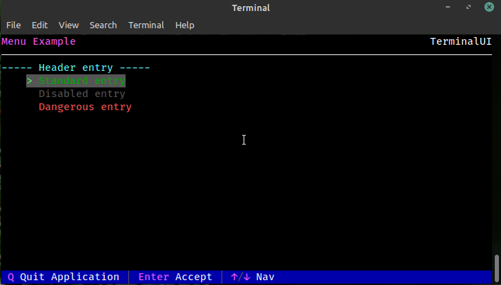
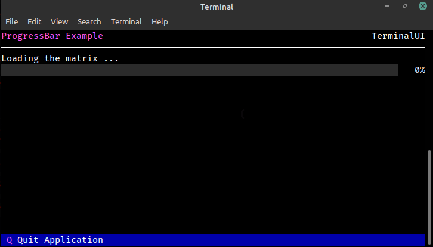

# Elements
## Menu
Basic menu element that allows listing multiple options and allows the user to 
interactively select one or more (multiple select not yet implemented) items

## DataTable
The data table element is meant for displaying data in a table format

At some point in the future, it will also be able to be used for editing 
data in a table, but we aren't there yet

## Header
A header element is a two-line element that is comprised of two other elements. 
The first line is a `SplitLine` element the second element is a `HorizontalLine`
element. By default, this element is used at the top of a TerminalUI application
when it is started with `Terminal.Run()`

## HorizontalLine
A horizontal line element is exactly what it sounds like.. a horizontal line that 
is used to separate a line above and below it

## KeyValueText
A class to display a KeyValue textual item. A KeyValueText element consists of two 
pieces of text.. a "Key", which is a "static" string, and a "Value" which is a dynamic 
and frequently changing string

## NotificationBox
A notification box is meant to be displayed above the rest of the elements for a 
notification or, at some point in the future, maybe used to query the user for 
information of some sort

## Pager
Pager element that is used for displaying multi-line text that overflows beyond what the 
terminal is able to display. This element can be scrolled to allow for easy viewing of the content.

## ProgressBar
A Progress bar element is designed for quickly displaying a visual representation of 
progress as a percentage on a line bar

## QueryYesNo
Simple element that is used to await a yes/no answer from the user

## SplitLine
Split-line element. This is used for displaying two pieces of text on a line, one is 
left-justified and the other is right justified

## Text
This is a very simple element that just displays text by itself

## StatusBar **
A status bar element is a special element that can only exist once and will be shown on the very 
bottom line of the screen. The status bar is also the entry point for any terminal key input