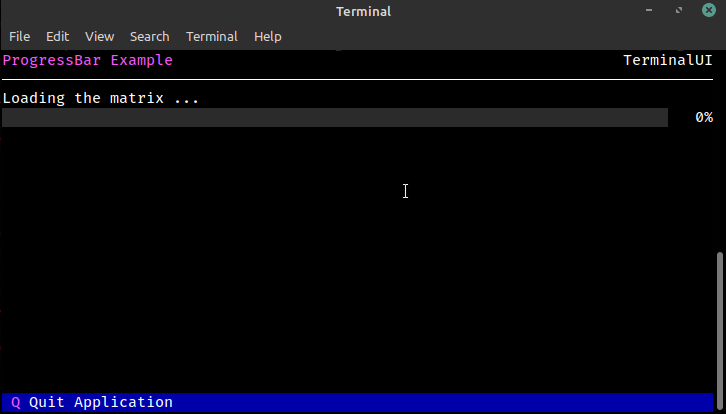

## Example

```csharp
static async Task RunExample(CancellationTokenSource cts)
{
    Text text = new Text("Loading the matrix ...", show: true);
    Terminal.NextLine();
    
    ProgressBar progress = new ProgressBar(show: true);

    for (int i = 0; i <= 10; i++)
    {
        if (cts.IsCancellationRequested)
            return;

        progress.UpdateProgress((double)i / 10.0);
        await TaskHelpers.Delay(400, cts.Token);
    }
}
```

